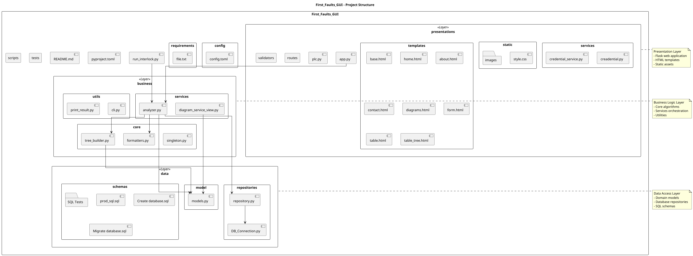

# Projectvoorstel: Historische Eerste Foutanalyse UI

## 1. Team

- **Benoit** – Frontend (UI & visualisaties)
- **Tom** – Backend (API, databaseconnectie)
- **Bertje** – Data-analyse (queries, rapportage)

**Deadline:** 11 juni (MVP), tussentijdse vooruitgang: 26 februari  
**Rapportage:** Maandelijks

## 2. Projectomschrijving

Ontwikkeling van een Python-gebaseerde webapplicatie die historische alarmen uit CIMPLICITY (SQL Server) visualiseert en analyseert. 

**Doel:** Trends detecteren (stijging van dezelfde alarmen binnen een tijdsperiode), top-10 alarmen per PLC, en rapportage per dag/week/maand.

## 3. Marktonderzoek

### Vergelijkbare software:
- **CIMPLICITY Alarm Viewer** – beperkt tot real-time, geen historische analyse
- **Proficy Operations Hub** – dashboarding, maar niet flexibel voor vrije queries
- **Historian Client** – sterk, maar niet gericht op alarmtrends per PLC

### Doelpubliek:
Regeltechniekers, lijnverantwoordelijken, productiebedienden bij Arcelor die CIMPLICITY gebruiken of personeel die het onderhoud op de site doet om vroegtijdige problemen op te sporen.

### Uniek punt:
- Vrije query's op historische alarmdata
- Trendanalyse (stijgingen per PLC)
- Automatische PDF-rapporten
- Gebruiksvriendelijke UI binnen IIS met user-identificatie

## 4. Technologiekeuzes

- **Backend:** Django of Flask (nog te bepalen)
- **Database:** SQL Server via pyodbc
- **Charts:** Matplotlib (voor grafieken)
- **Rapporten:** PDF via ReportLab of WeasyPrint
- **Run-omgeving:** IIS (Windows), security via IIS user-identificatie
- **Niet gebruiken:** Shiny (R-based, niet Python)

## 5. High-level Architectuur

### Minstens 2 Python-modules:
- `db_access.py` – SQL Server connectie & query's
- `analysis.py` – Trendberekening & top-10 alarmen
- `ui_app.py` – Webinterface (Flask/Django)
- `reporting.py` – PDF-generatie

### Flow:
```
SQL Server → Query-service → Analyse → UI (filters, grafieken) → Rapportage
```

## 6. Planning

- **Week 1-4:** DB-connectie & basisqueries (Tom)
- **Week 5-8:** Analyse & trendlogica (Bertje)
- **Week 9-12:** UI & grafieken (Benoit)
- **Week 13-14:** Rapportage & integratie

**Vooruitgangsmoment:** 26 feb → werkende query + eerste grafiek  
**MVP:** 11 juni → volledige flow + rapportage

## 7. Key Queries

- Fouten per PLC op 24u
- Alarmen die stijgen per dag/week
- Top-10 alarmen per PLC (week/maand)
- Grafieken per PLC (trend, Pareto)

## 8. Runnen

flask --app app run --debug

## Structure

