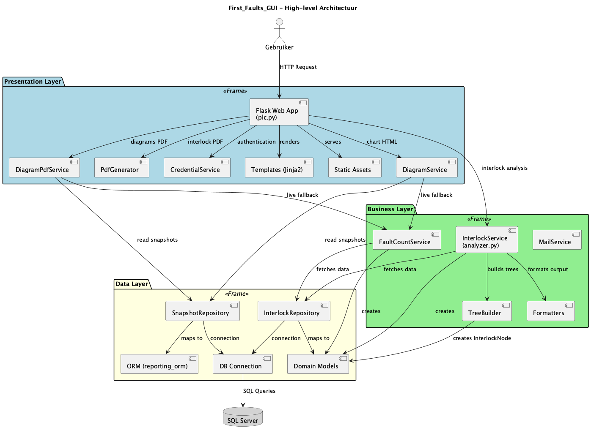
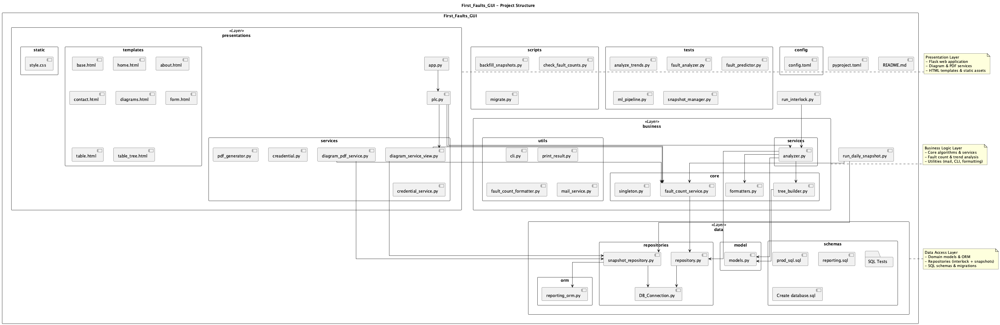

# Projectvoorstel: Historische Eerste Foutanalyse UI

## 1. Team

- **Benoit** – Frontend (UI & visualisaties, API)
- **Tom** – Backend (databaseconnectie, queries, rapportage)

**Deadline:** 11 juni (MVP), tussentijdse vooruitgang: 26 februari  
**Rapportage:** Maandelijks

## 2. Projectomschrijving

Ontwikkeling van een Python-gebaseerde webapplicatie die historische alarmen uit CIMPLICITY (SQL Server) visualiseert en analyseert.

**Doel:** Trends detecteren (stijging van dezelfde alarmen binnen een tijdsperiode), top-10 alarmen per PLC, en rapportage per dag/week/maand.

## 3. Marktonderzoek

### Vergelijkbare software:
- **CIMPLICITY Alarm Viewer** – beperkt tot real-time, geen historische analyse
- **Proficy Operations Hub** – dashboarding, maar niet flexibel voor vrije queries
- **Historian Client** – sterk, maar niet gericht op alarmtrends per PLC

### Doelpubliek:
Regeltechniekers, lijnverantwoordelijken, productiebedienden bij Arcelor die CIMPLICITY gebruiken of personeel die het onderhoud op de site doet om vroegtijdige problemen op te sporen.

### Uniek punt:
- Vrije query's op historische alarmdata (in progress)
- Trendanalyse (stijgingen per PLC)
- Automatische PDF-rapporten
- Gebruiksvriendelijke UI binnen IIS met user-identificatie

## 4. Technologiekeuzes

- **Backend:** Flask (Python)
- **Database:** SQL Server via SQLAlchemy + pyodbc
- **Charts:** Plotly (interactieve grafieken, server-side gerenderd als HTML)
- **Rapporten:** PDF-export vanuit de Table Tree pagina
- **Run-omgeving:** IIS (Windows), security via IIS user-identificatie
- **Frontend:** Jinja2 templates, Bootstrap 5

## 5. Architectuur

### High-level Architectuur


### Lagenstructuur

```
presentations/          UI-laag (Flask Blueprint, templates, services)
  plc.py                Routes (Blueprint "plc")
  templates/            Jinja2 HTML-templates
  services/             View-services (DiagramService, DiagramPdfService, PdfGenerator)

business/               Business-laag
  services/             InterlockService, FaultCountService

data/                   Data-laag
  repositories/         SnapshotRepository, DB_Connection
  orm/                  SQLAlchemy ORM-modellen
```

### Flow:
```
SQL Server -> Repository -> Business Service -> Presentation Service -> Template -> Browser
```

## 6. Pagina's

### Home (`/plc/`)
Landingspagina.

### Diagrams (`/plc/diagrams`)
Dashboard met zes grafieken en een heatmap.

- **Selectie:** Maand + week-van-de-maand dropdowns. De eerste maandag van die week wordt berekend en als `reference_date` doorgegeven om historische snapshots te filteren.
- **Grafieken:** Faults per hour, Faults per PLC (pie), Top risers, MTBF per PLC, Top 10 climbing faults, Repeat offenders.
- **Heatmap:** Per PLC, selecteerbaar via aparte dropdown.
- **PDF export:** Alle grafieken worden via `DiagramPdfService` gerenderd als PNG (Plotly + Kaleido) en samengevoegd in een landscape PDF (ReportLab). Route: `/plc/diagrams-pdf`.
- **Spinner:** Globale loading overlay (uit `base.html`) bij navigatie en form submits.

Zie [docs/diagrams_page.md](docs/diagrams_page.md) voor gedetailleerde documentatie.

### Table Tree (`/plc/table-tree`)
Interlock-boomstructuur met filters en PDF-export.

- **Filters:** Target BSID, Top N, PLC, tijdsperiode, conditiebericht.
- **PRG-patroon:** POST valideert en redirect naar GET met query params.
- **Boom:** Recursieve Jinja2 macro met in-/uitklapbare rijen via JavaScript.
- **PDF:** Async download via `fetch`, zonder paginanavigatie.
- **Validatie:** Server-side parsing van integers en ISO datetimes met flash-meldingen bij fouten.

Zie [docs/table_tree_page.md](docs/table_tree_page.md) voor gedetailleerde documentatie.

### About (`/plc/about`) & Contact (`/plc/contact`)
Informatieve pagina's.

## 7. Globale Spinner

Gedefinieerd in `base.html`, beschikbaar op alle pagina's:
- Wordt geactiveerd bij klik op navigatielinks en bij elke form submit.
- Toont een overlay met draaiende spinner terwijl de server data laadt.

## 8. Key Queries

- Fouten per PLC op 24u
- Alarmen die stijgen per dag/week
- Top-10 alarmen per PLC (week/maand)
- Grafieken per PLC (trend, Pareto)
- MTBF per PLC
- Repeat offenders (max herhalingen per uur)
- Heatmap (uur x datum per PLC)

## 9. Planning

- **Week 1-5:** Analyse + DB-connectie & basisqueries + eerste UI (Tom, Benoit)
- **Week 5-8:** Agile iteratie op andere usecases
- **Week 9-14:** Rapportage & integratie

**Vooruitgangsmoment:** 26 feb -> werkende query + eerste grafiek  
**MVP:** 11 juni -> volledige flow + rapportage

## 10. Runnen

```bash
flask --app app run --debug
```

## 11. Documentatie

- [Diagrams pagina](docs/diagrams_page.md) – opbouw, spinner, selectieboxen, dataflow
- [Table Tree pagina](docs/table_tree_page.md) – flow, boomstructuur, JavaScript, validatie
- [Projectverloop](docs/project_verloop.md) – tijdlijn, Gantt chart, bereikte doelen per fase

## Structure


## Licence

Copyright (c) 2025 Tom Van de Vyver / Goethals Benoit

This source code is provided for viewing purposes only.

You may NOT:
- Use this code in any project
- Copy, modify, or distribute this code
- Use this code for commercial or non-commercial purposes

All rights reserved.
