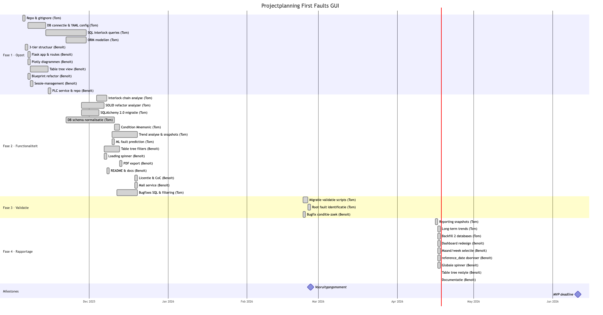
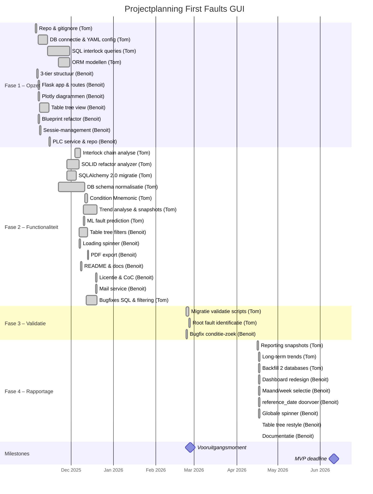

# Projectverloop

Overzicht van het verloop van het project, gebaseerd op de Git-geschiedenis. Totaal: ~162 commits door twee teamleden.

## Teamverdeling

| Wie | Rol | Commits |
|-----|-----|---------|
| **Benoit** (benoit / Benoit Goethals) | Frontend, UI, templates, routing, PDF | ~60 |
| **Tom** (TVDV / bucofski) | Backend, database, SQL, analyse, rapportage | ~102 |

## Gantt Chart

Mermaid broncode

## Tijdlijn per fase

### Fase 1: Opzet & Basis (november 2025)

**59 commits**

#### Tom
- Repository aangemaakt met `.gitignore` en basisconfiguratie
- Eerste databaseconnectie opgezet (YAML config, pyodbc)
- SQL-functies voor interlock fault-chain analyse geschreven
- SQLAlchemy ORM-modellen gedefinieerd
- Testscripts voor DB-connectie

#### Benoit
- 3-tier projectstructuur opgezet (`presentations/`, `business/`, `data/`)
- Flask app geinitialiseerd met routes en templates
- Eerste diagrammen met Plotly (bar chart, pie chart)
- Tabel- en table-tree views aangemaakt
- Blueprint-structuur ingevoerd (rename `audit` -> `plc`)
- Sessie-management en user credentials toegevoegd
- PLC service en repository laag opgezet

**Doelen bereikt:**
- Werkende Flask applicatie met navigatie
- Eerste grafieken zichtbaar
- Databaseconnectie operationeel
- Basisstructuur voor interlock-analyse

---

### Fase 2: Functionaliteit & Bugfixes (december 2025)

**94 commits**

#### Tom
- Interlock chain analyse uitgebreid met recursieve upstream/downstream logica
- `InterlockAnalyzer` gerefactord naar SOLID principes, daarna hernoemd naar `InterlockService`
- SQLAlchemy 2.0 migratie doorgevoerd
- SQL-functies voor filtering (timestamp, PLC, Top N) verbeterd
- Database schema genormaliseerd + migratiescripts
- `Condition_Mnemonic` ondersteuning toegevoegd
- Fault trend analyse en snapshot schema ontwikkeld
- ML-gebaseerde fault prediction tools toegevoegd (TensorFlow)
- Diverse bugfixes op SQL queries en filtering

#### Benoit
- Table tree template volledig opgebouwd met filters (BSID, PLC, tijdsperiode, conditiebericht)
- Loading spinner toegevoegd bij form submits
- PDF-export geimplementeerd met ReportLab
- `filter_bit_index` toegevoegd en later verwijderd (iteratief)
- `filter_date` support verwijderd na herontwerp
- README uitgebreid met architectuurdiagram, rollen, licentie
- Code of Conduct en Apache License toegevoegd
- MailService utility gebouwd
- Diverse template refactors voor consistentie

**Doelen bereikt:**
- Volledige interlock-boomstructuur met in-/uitklappen
- PDF-export werkend
- Filterfunctionaliteit compleet
- Database genormaliseerd
- Trend analyse basis gelegd

---

### Fase 3: Validatie & Migratie (februari 2026)

**3 commits**

#### Tom
- SQL migratie validatie- en testscripts toegevoegd
- Interlock chain queries en root fault identificatie
- Side-by-side database vergelijkingslogica
- Repository TVF kolom handling aangepast

#### Benoit
- Bugfix op conditie-zoekfunctie (PR #45)

**Doelen bereikt:**
- Migratievalidatie naar nieuwe databasestructuur
- Stabielere queries

---

### Fase 4: Rapportage & Dashboard (april 2026)

**8 commits**

#### Tom
- Reporting tools toegevoegd (snapshots, backfill)
- Long-term trend rapportage (regressie-analyse)
- Repeat offenders, MTBF, top risers snapshots
- Twee databases configureerbaar voor backfill

#### Benoit
- Diagrams pagina herontworpen met Bootstrap grid (2-koloms layout)
- Maand/week selectieboxen met berekening eerste maandag
- `reference_date` doorgevoerd door alle lagen (route -> service -> repository)
- Globale loading spinner in `base.html` (werkt bij navigatie + form submits)
- Table Tree pagina gerestyled met Bootstrap (cards, responsive table, dark header)
- Status kolom verwijderd uit table tree
- Documentatie geschreven (diagrams, table tree, README update)

**Doelen bereikt:**
- Dashboard met 6 grafieken + heatmap
- Historische data opvraagbaar via maand/week selectie
- Consistente look & feel over alle pagina's
- Globale spinner voor betere gebruikerservaring
- Projectdocumentatie compleet

---

## Bereikte doelen (samenvatting)

| Doel | Status | Verantwoordelijke |
|------|--------|-------------------|
| Flask applicatie met routing | Bereikt | Benoit |
| 3-tier architectuur | Bereikt | Benoit |
| Database connectie (SQL Server) | Bereikt | Tom |
| Interlock chain analyse | Bereikt | Tom |
| Boomstructuur UI met filters | Bereikt | Benoit + Tom |
| PDF-export | Bereikt | Benoit |
| Diagrammen (Plotly) | Bereikt | Benoit |
| Snapshot/rapportage systeem | Bereikt | Tom |
| Trend analyse (risers, climbers) | Bereikt | Tom |
| MTBF berekening | Bereikt | Tom |
| Heatmap per PLC | Bereikt | Benoit + Tom |
| Historische data filtering (maand/week) | Bereikt | Benoit |
| Globale loading spinner | Bereikt | Benoit |
| Database migratie & validatie | Bereikt | Tom |
| ML fault prediction (experimenteel) | Bereikt | Tom |
| Sessie-management | Bereikt | Benoit |
| Mail service | Bereikt | Benoit |
| Documentatie | Bereikt | Benoit |

## Branches

- `Develop` — hoofdbranch voor development
- `feature/reporting` — rapportage en snapshot functionaliteit
- `feature/DB` — database schema en connectie
- Diverse `Bugfix/*` branches via pull requests
- Feature branches per taak (bv. `feature/benoit/pdf`, `feature/benoit/fiilter_bit`)
